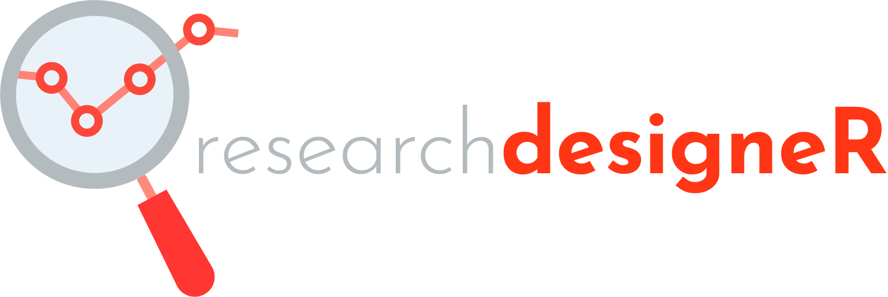

## researchdesigneR - Selecting data science methods for analysis centered on patients
researchdesigneR is a collection of structured documents to guide clinicians designing clinical research studies and data scientists conducting the respective analyses. Rather than a book, the researchdesigneR's goal is to serve as a decision support system, where you can get information on (1) the clinical situations where a given method might be useful, (2) what types of variables are required to run that method, (3) how the method works, and (4) how to interpret the results coming from the method.

# Motivation
The primary goal of researchdesigneR is to provide data scientists with a decision support system to assist in designing clinical research projects. Its content can be accessed through the wiki pages for this repository, which describes a set of data science methods, commonly used data sets, and visualization methods.
 
 
# Description style for each method and data set
We use standard templates to describe both data scientists' methods as well as data sets.

# How to use

# Features
* New data science methods are constantly added based on the latest R packages and publications in high-impact clinical research journals.
* The information on data science methods and data sets is presented pragmatically to facilitate their immediate application to research projects answering relevant clinical research questions.

# Contributing
To contribute, please send an email to contact@sporedata.com, and we will add you to the repository.

# License
<!-- @todo add mit license -->

<!--  
https://github.com/othneildrew/Best-README-Template
https://github.com/matiassingers/awesome-readme

* description: problem - large number of approaches in the analysis of patient data, little time to learn them; a lot of literature, but what we need is a decision support system
template-based, searchable, SEO, potentially connected to solr
* use cases:
   - design: meetings, plan for projects, grant proposals, journal clubs
      * start question
      * start data
      * start methods
   - api - solr, rstudio integration; figures concept map
* template: methods, data, plots
* motion graphic - how to search - gif web page, ag repo (within section) with code examples
* todo 
* contributing - clone send, pull request; wiki
* credits
* licensing
* FAQ
* support
--> 
